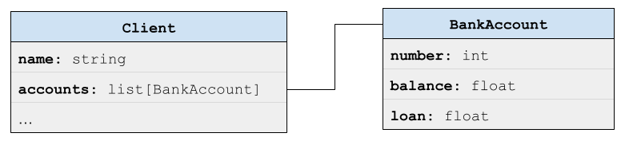
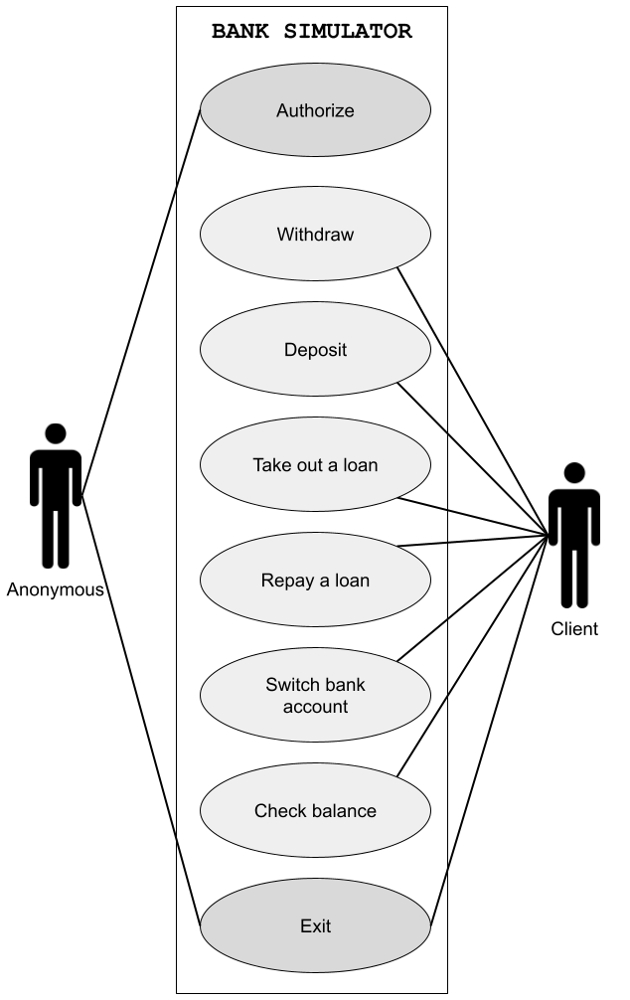

# Bank simulation
Team members: Maciulevičiūtė Elena, Roenko Vitaliya, Šukytė Kotryna.

---

## 1. Project problem


The aim of the project is to show a simulation of a bank in which the player, 
acting as a customer, can perform various actions, such as withdrawing money, 
depositing money into an account and obtaining loans. 

---

## 2. Server and Client Setup
Create project directory and go into it:
```bash
mkdir BankProject
cd BankProject
```

### 2.1 Server Setup
In the first terminal open `server.py` file, paste source code and save it:
```bash
vim server.py
```

Run server:
```bash
python3 server.py
```

### 2.2 Client Setup
Open second terminal, go to project directory. Next, open `client.c` file, paste source code and save it:
```bash
vim client.c
gcc client.c
```

Run client:
```bash
./a.out
```

---
## 3. Architecture (client–server interaction)
The system consists of two parts: client and server.
The client sends a request to the server, which processes it and sends a response. 
Communication occurs using the game.sock file and *Unix Domain Socket*.

 
 ---

## 4. Data structures
Two classes are used:
- Client  ( User's personal account )
- BankAccount ( Banking information: accounts, loans )
A client may have several bank accounts.


---

## 5. Game logic
Before authorisation, the player is anonymous and has only two options:
- Autorization
- Exit
After authorisation, the player becomes a customer and all other options become available:
1. Withdraw money
2. Deposit money
3. Take out a loan
4. Repay a loan
5. Switch bank account
6. Check balance


---